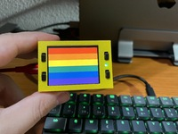

# Raspberry Pi Pico Display 2.0 (Pimoroni version, 320x240px)

Proyecto con raspberry pi pico como servidor websockets en el que se utiliza la pantalla Pico Display 2.0 para mostrar estadísticas de los equipos en la red local de la cantidad de teclas pulsadas 

Sitio web del autor: [https://raupulus.dev](https://raupulus.dev)

Repository [https://gitlab.com/raupulus/rpi-pico-project-picodisplay2-keycounter-websocket](https://gitlab.com/raupulus/rpi-pico-project-picodisplay2-keycounter-websocket)

  
  
  
  

## Modelo para la caja 3D

Puedes descargar mi diseño para **Pico Display 2.0** desde el siguiente enlace:

[https://www.thingiverse.com/thing:6662007](https://www.thingiverse.com/thing:6662007)

## Preparar proyecto

Antes de comenzar, hay que copiar el archivo **.env.example.py** a **env.py** 
y rellenar las variables con los datos del wireless y de acceso a la API.

Una vez preparado, subir a la raspberry todo el contenido del directorio **src**

## Instalar micropython para Pico Display 2.0

Sitio web de la pantalla: [Pimoroni](https://shop.pimoroni.com/products/pico-display-pack-2-0?variant=39374122582099)

[Ejemplos para probar la pantalla](https://github.com/pimoroni/pimoroni-pico/tree/main/micropython/examples/pico_display)

Para poder utilizar la pantalla necesitamos instalar el firmware de micropython con soporte para esta pantalla que lo podemos encontrar en el siguiente enlace:

[https://github.com/pimoroni/pimoroni-pico/releases](https://github.com/pimoroni/pimoroni-pico/releases)

En el momento de crear el proyecto está la versión 1.23.0 (https://github.com/pimoroni/pimoroni-pico/releases/download/v1.23.0-1/picow-v1.23.0-1-pimoroni-micropython.uf2)
